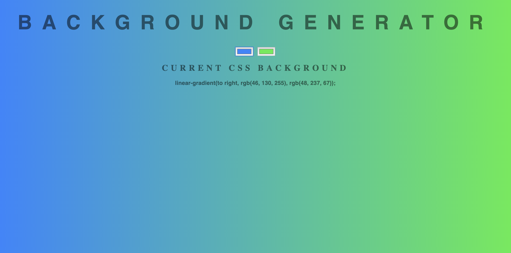

# ZTM Web Developer Bootcamp - Background Gradient Generator

## Welcome! 👋

Thanks for checking out this front-end coding challenge. It was built to practise the concepts I got from ZTM's DOM Manipulation section. Looking forward to creating more cool tools like this.

Made with ❤
